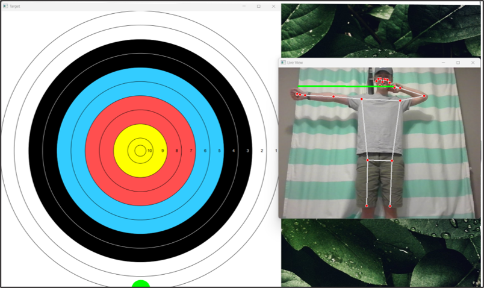

# Virtual Archery Application
Utilizes MediPipe's Pose API to calculate the position of a person joints from a camera image which is then used to simulate a shot in archery.

How it works:

 - Calculated points of joints are transformed from 3D to a 2D plane
 - Arrow position is based upon points at release
 - Calculated until set distance + height of target
 - All major bow variables included (Poundage, Arrow Weight, String Weight, Draw Length, and Rated fps)
 - Projectile Physics Used for simulation of shot

Features:

 - Includes Visual Aid for Location of Shot
 - Imposed Arrow Location via green line
 - Included many bow variables to allow for many different bow setups
 - Very precise outputs in meters, up to 16 decimals
 - Detects when the shot is released based upon draw length and back tension distance

Known Issues:

 - Has trouble with depth

Future Work:

 - Add some type of marker tracking system to help the program calculate depth easier (this should, in turn, improve accuracy)
